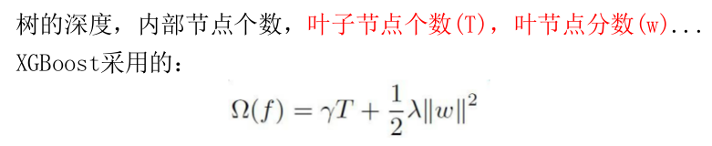
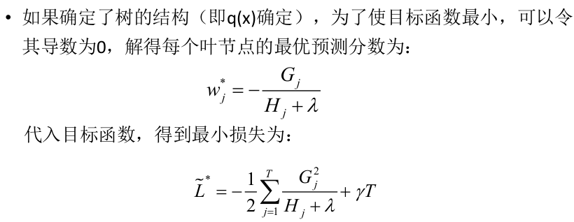
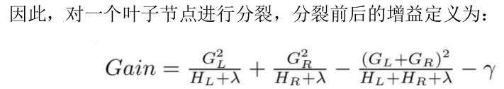
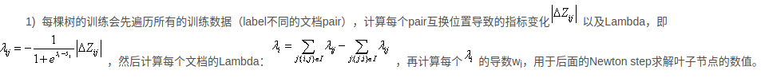

### 1.ngram距离：
    https://www.jianshu.com/p/e0598adb07ad
### 2.去停词是根据词表做的
### 3.word2vec：
    浅层神经网络，https://www.cnblogs.com/guoyaohua/p/9240336.html，限制了100维，求cos值4.https://blog.csdn.net/AugustMe
    /article/details/97623718，sin值用1去减
### 5.方差：
    https://blog.csdn.net/xidiancoder/article/details/71341345
### 6.均方根误差：
    https://blog.csdn.net/zengxiantao1994/article/details/77855644

### 7.ndcg：
    https://www.cnblogs.com/by-dream/p/9403984.html
    归一化的择损累计增益：高度关联更影响指标的分，位置更靠前指标更高
    cg：累计增益，只考虑相关性程度，不考虑位置，是分数相加
    dcg：折损累计增益，在每一个cg下除以一个折损值，使得排序越往后价值越低
    ndcg：做归一化处理，除以idcg，理想情况下的dcg

### 8.td/idf：
    https://zhuanlan.zhihu.com/p/31197209
    tf：词频，某个词在文章中出现次数/文章总词数
    idf：逆文档频率，给出现频率大的词一个较小的权重，log（文档总数/ 词出现在文档次数+1），分母越大idf越小
    tf-idf：两者相乘，这个词越大在越重要
### 9.xgb
   
   gi是一阶导，hi是二阶导
   
   
   gain增益越大，L减小的越多，说明梯度下降的快，所以选增益最大的

### 10.lambdaMart：
   https://blog.csdn.net/huagong_adu/article/details/40710305
   https://liam.page/2016/07/10/a-not-so-simple-introduction-to-lambdamart/
   实际上就是替换gbdt中的梯度，用lambda值表示，代表了下一次应该优化的方向和强度，推导依赖于lambdarank和ranknet，就是对Pair i,j 用交叉熵概率预测真实值，实际上通过梯度值lambada，反推出损失函数
   
### 11.sigmod：
    1/1+e^-x
### 12.relu：
    y=x x>0 y=0 x<0
### 13.f1值：
    f1=2*正确率*召回率/(正确率+准确率)
### 14.平方损失、逻辑损失函数：
    square loss：求和(y-x)^2
    log loss：-logP(y|x)
