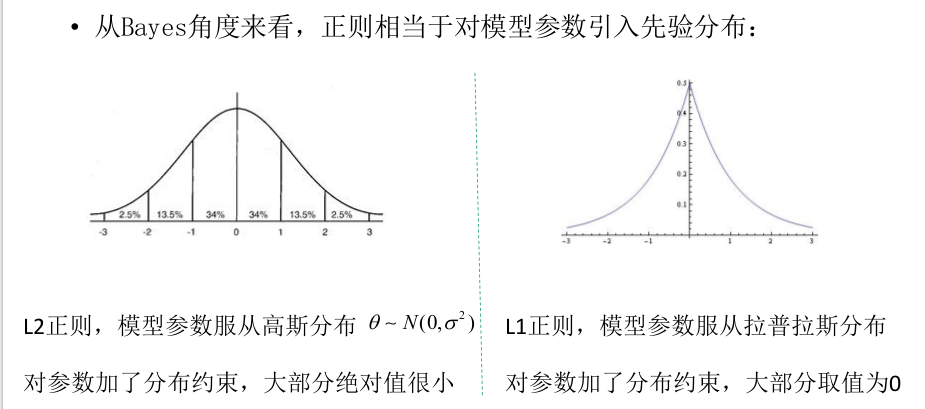

1.L1和L2正则的区别？
    L1：是权重的绝对值之和，用于特征选择
    L2：是各值的平方和再求平方根，用于防止过拟合
    

2.rmse、mse、标准差的区别
   方差：距离平均值平方的距离
   标准差：衡量一组数的离散程度
                 
   mse：均方误差是指参数估计值与参数真值之差平方的期望值; 
             MSE可以评价数据的变化程度，MSE的值越小，说明预测模型描述实验数据具有更好的精确度。
              求和(x-xi)^2/n
   rmse：对mse开平方
3.防止过拟合
   学习速率
    叶子节点最小权重
    最大树深度
    gramma值（作用于叶子节点数，调大）
    行采样，列采样
    lambda值
4.bm25：
    https://www.jianshu.com/p/1e498888f505